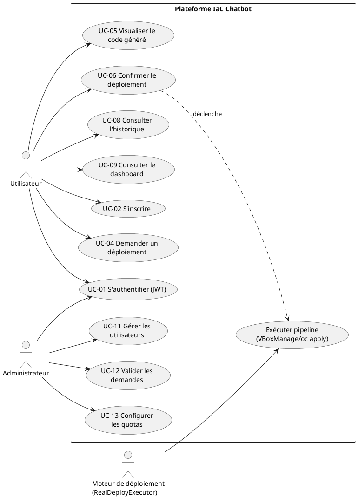
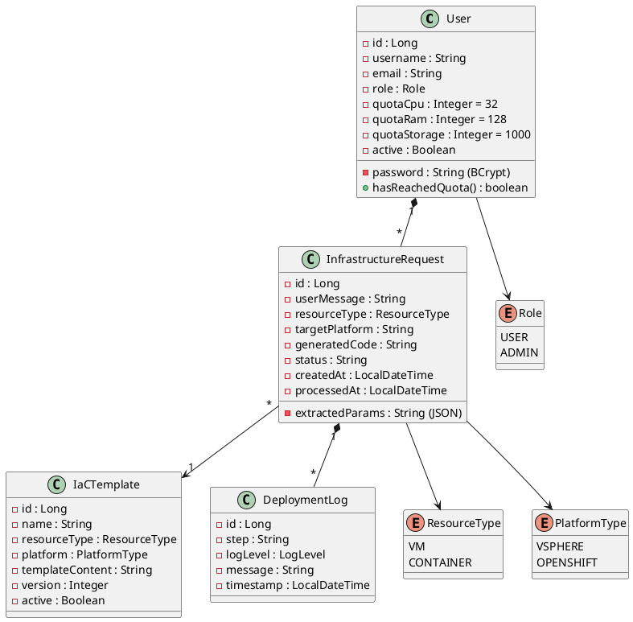
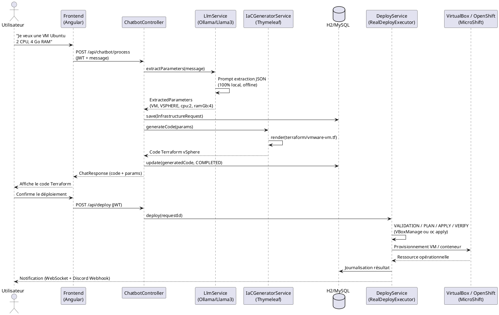

# ARCHITECTURE DU PROJET — VERSION FINALE
## Infrastructure as Code & Automation pilotée par Chatbot Intelligent

> **Version FINALE 3.0** — Alignée sur le document officiel de la société et sur l'implémentation réelle.
> Corrections par rapport à la version précédente : **Ollama + Llama 3** remplace OpenAI API,
> **VMware vSphere + OpenShift** remplacent tout cloud public (AWS exclu).

---

## Stack technique

| Couche | Technologie | Rôle |
|---|---|---|
| Frontend | Angular 17+ (prototype HTML/JS fonctionnel) | Interface utilisateur (chatbot + dashboard) |
| Backend | Spring Boot 3.2+ | API REST, logique métier |
| IA / LLM | **Ollama + Llama 3 (local, gratuit)** | Extraction paramètres langage naturel |
| Base de données | H2 (dev) / MySQL 8.0 Community (prod) | Stockage historique et utilisateurs |
| Templates | Thymeleaf (mode TEXT) | Génération dynamique code IaC |
| IaC VMware | Terraform (code généré) / **VirtualBox** (exécution réelle locale via VBoxManage) | Provisioning VMs |
| IaC OpenShift | oc + kubectl / **MicroShift 4.18** (cluster OpenShift réel en VM VirtualBox) | Déploiement conteneurs et KubeVirt |
| Exécution déploiements | `RealDeployExecutor` (mode `deploy.mode=real`) : VBoxManage + oc | Pipeline validation/journalisation/contrôle |
| Conteneurs | Docker Desktop | Conteneurisation locale |
| Sécurité | Spring Security + JWT | Authentification et autorisation |
| Temps réel | WebSocket STOMP | Chat interactif |

---

## 1. Diagramme de Cas d'Utilisation

### Acteurs

| Acteur | Description | Privilèges |
|---|---|---|
| Utilisateur | Développeur, ops ou chef de projet qui demande des ressources via le chatbot | S'authentifier, demander déploiement, visualiser code, consulter historique, annuler |
| Administrateur | Responsable infrastructure qui supervise la plateforme | Tout + valider demandes, gérer quotas, statistiques globales, templates |
| Moteur de déploiement | `RealDeployExecutor` (backend) qui exécute automatiquement le pipeline | Exécuter VBoxManage (VirtualBox), oc apply (OpenShift/MicroShift), journaliser résultats |

### Diagramme (PlantUML)



---

## 2. Diagramme de Classes

### Relations entre les classes

| Relation | Type | Cardinalité | Description |
|---|---|---|---|
| User → InfrastructureRequest | Composition | 1 → * | Un utilisateur peut faire plusieurs demandes |
| InfrastructureRequest → IaCTemplate | Association | * → 1 | Chaque demande utilise un template |
| InfrastructureRequest → DeploymentLog | Composition | 1 → * | Une demande génère plusieurs logs |

### Diagramme (PlantUML)



---

## 3. Diagramme de Séquence — Déploiement d'une VM (VirtualBox local / VMware vSphere entreprise)

### Description du flux principal

| Étape | Action | Détails |
|---|---|---|
| 1-4 | Extraction des paramètres | L'utilisateur formule une demande en langage naturel. Le système utilise **Ollama (Llama 3)** en local pour extraire les paramètres (type, plateforme, CPU, RAM, stockage, OS) |
| 5-7 | Génération du code IaC | Spring Boot utilise **Thymeleaf** (mode TEXT) pour générer le code Terraform vSphere. Le code est stocké en base |
| 8-12 | Validation et déclenchement | L'utilisateur visualise le code généré et confirme. Le système met à jour le statut et déclenche le pipeline de déploiement (`RealDeployExecutor`) |
| 13-16 | Exécution du déploiement | Le moteur exécute `VBoxManage` (création VM réelle dans VirtualBox) ou `oc apply` (OpenShift/MicroShift). Résultat journalisé |
| 17-20 | Notification et confirmation | Notification (Discord Webhook) et affichage de la confirmation à l'utilisateur |

### Diagramme (PlantUML)



---

## 4. Structure du Projet (implémentation réelle)

```
iac-chatbot-backend/
├── src/main/java/com/company/iacchatbot/
│   ├── IacChatbotApplication.java
│   ├── config/
│   │   ├── SecurityConfig.java          # Spring Security + JWT
│   │   ├── OllamaConfig.java            # Configuration Ollama (Spring AI)
│   │   ├── IaCTemplateConfig.java       # Moteur Thymeleaf TEXT pour IaC
│   │   └── DataInitializer.java         # Utilisateurs par défaut
│   ├── controller/
│   │   ├── AuthController.java          # /api/auth/**
│   │   ├── ChatbotController.java       # /api/chatbot/**
│   │   ├── DeployController.java        # /api/deploy/** (simulation)
│   │   ├── HistoryController.java       # /api/history/**
│   │   ├── AdminController.java         # /api/admin/** (approbations)
│   │   └── UserController.java          # /api/users/** (ADMIN)
│   ├── dto/
│   │   ├── ChatRequest.java             # {message, targetPlatform}
│   │   ├── ChatResponse.java            # {status, params, generatedCode}
│   │   ├── ExtractedParameters.java     # {resourceType, platform, cpu, ramGb...}
│   │   ├── ProgressEvent.java           # Événement WebSocket /topic/progress
│   │   ├── QuotaRequest.java            # {quotaCpu, quotaRam, quotaStorage}
│   │   ├── LoginRequest.java / LoginResponse.java
│   │   ├── RegisterRequest.java / UserDto.java / MessageResponse.java
│   ├── model/
│   │   ├── User.java                    # JPA + rôles + quotas
│   │   ├── InfrastructureRequest.java   # JPA demande + code généré + user
│   │   ├── DeploymentLog.java           # JPA journal des étapes
│   │   ├── IaCTemplate.java             # JPA templates versionnés
│   │   ├── ResourceType.java            # VM, CONTAINER
│   │   ├── PlatformType.java            # VSPHERE, OPENSHIFT
│   │   ├── DeploymentStatus.java        # PENDING, CODE_GENERATED, RUNNING...
│   │   ├── LogLevel.java                # INFO, WARN, ERROR
│   │   └── Role.java                    # USER, ADMIN
│   ├── repository/                      # 4 repositories JPA
│   ├── service/
│   │   ├── AuthService.java             # login, register, JWT
│   │   ├── LlmService.java              # Extraction via Ollama (Llama 3)
│   │   ├── IaCGeneratorService.java     # Génération Thymeleaf (vSphere/OpenShift/KubeVirt)
│   │   ├── DeployService.java           # Déploiement simulé + logs
│   │   ├── QuotaService.java            # Contrôle quotas (UC-13)
│   │   ├── NotificationService.java     # Discord Webhook
│   │   ├── ProgressNotificationService.java  # WebSocket temps réel
│   │   ├── UserService.java
│   │   └── UserDetailsServiceImpl.java
│   ├── exception/
│   │   ├── GlobalExceptionHandler.java  # Format d'erreur standard
│   │   ├── QuotaExceededException.java
│   │   └── DeploymentFailedException.java
│   └── security/
│       ├── JwtTokenProvider.java
│       ├── JwtAuthenticationFilter.java
│       └── JwtAuthenticationEntryPoint.java
├── src/main/resources/
│   ├── templates/
│   │   ├── terraform/
│   │   │   └── vmware-vm.tf             # Template Thymeleaf Terraform vSphere
│   │   └── openshift/
│   │       ├── deployment.yaml          # Deployment Kubernetes
│   │       ├── service.yaml             # Service
│   │       ├── route.yaml               # Route OpenShift
│   │       └── kubevirt-vm.yaml         # VirtualMachine KubeVirt + DataVolume
│   ├── application.properties
│   └── db/migration/
├── src/test/java/.../IaCGeneratorServiceTest.java   # 4 tests unitaires (100 % pass)
├── Dockerfile
└── pom.xml
```

---

## 5. Configuration et Dépendances

### Dépendances Maven principales (pom.xml)

- `spring-boot-starter-web` / `websocket` / `data-jpa` / `security` / `thymeleaf` / `validation`
- `org.springframework.ai:spring-ai-ollama-spring-boot-starter` — intégration Ollama (gratuit)
- `com.h2database:h2` (dev) / `com.mysql:mysql-connector-j` (prod)
- `io.jsonwebtoken:jjwt-api/impl/jackson` (0.12.5) — JWT
- `org.springdoc:springdoc-openapi-starter-webmvc-ui` (2.5.0) — Swagger
- `spring-boot-starter-test` + `spring-security-test` — tests

### Configuration (application.properties)

```properties
# Ollama (100% local et gratuit)
spring.ai.ollama.base-url=http://localhost:11434
spring.ai.ollama.chat.model=llama3
spring.ai.ollama.chat.options.temperature=0.2

# Base de données H2 (dev) — MySQL Community en prod
spring.datasource.url=jdbc:h2:mem:iac_chatbot

# JWT
jwt.secret=${JWT_SECRET}
jwt.expiration=86400000

# Swagger: http://localhost:8081/swagger-ui.html
```

---

## 6. Récapitulatif

Architecture moderne, enterprise-grade et **100 % gratuite** :

- **Frontend Angular** : interface réactive avec chatbot interactif et dashboard
- **Backend Spring Boot** : API REST sécurisée JWT, support WebSocket temps réel
- **IA Ollama (Llama 3)** : extraction intelligente FR/EN, 100 % locale et offline
- **Templates Thymeleaf** : génération IaC standardisée — Terraform (vSphere), YAML (OpenShift), KubeVirt
- **Multi-plateforme** : VMware vSphere (VMs) et OpenShift (conteneurs + VMs KubeVirt) — **aucun cloud public**
- **Pipeline de déploiement** : `RealDeployExecutor` avec étapes VALIDATION → PLAN → APPLY → VERIFY, exécution réelle (VBoxManage / oc) et contrôle
- **Exécution locale réelle** : VirtualBox (VMs) et MicroShift 4.18 (vrai cluster OpenShift en VM locale)
- **Traçabilité** : journalisation complète des demandes avec notifications

| Couche | Composants | Responsabilité |
|---|---|---|
| Présentation | Angular 17+, RxJS, WebSocket Client | Interface utilisateur, chatbot, dashboard |
| API Gateway | Spring Security, JWT Filter, CORS | Authentification, autorisation |
| Application | Spring Boot, Controllers, Services | Logique métier, orchestration |
| Intelligence | Ollama (Llama 3), Thymeleaf | NLP local, extraction, génération IaC |
| Données | Spring Data JPA, H2 / MySQL | Persistance, requêtes |
| Exécution | RealDeployExecutor (ProcessBuilder), VBoxManage, oc | Pipeline de déploiement réel |
| Infrastructure | VirtualBox (VMs), MicroShift/OpenShift (conteneurs), Terraform/oc (code généré) | Provisioning VMs, déploiement conteneurs |

---

*Document préparé pour validation par l'encadrant.*
*Stagiaire : [Nom] | Entreprise : [Nom] | Version : FINALE 3.0 — Septembre 2026*
